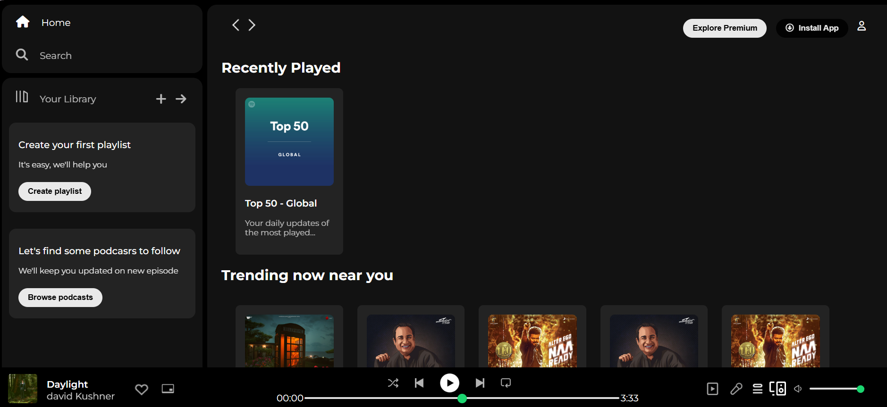
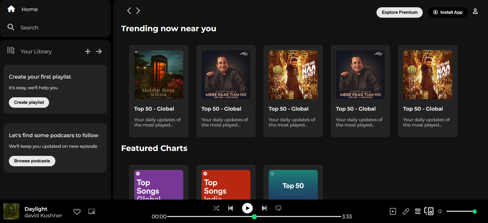
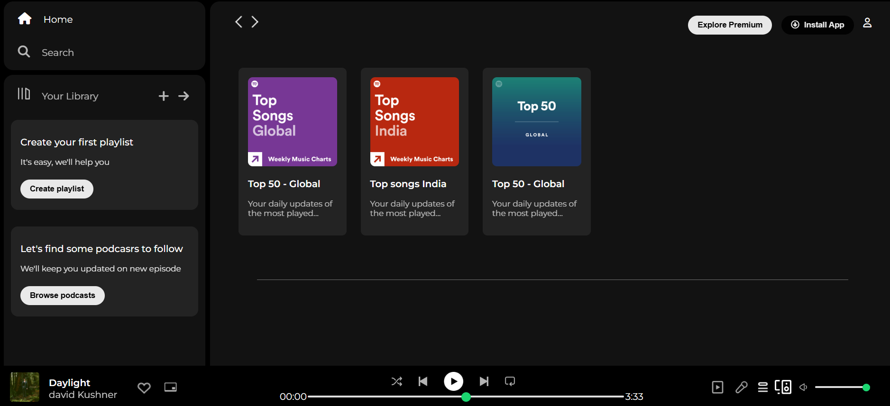

# Spotify Clone

**Live Demo:** [View Project](https://maazcodecraft.github.io/Spotify-clone)

---

A responsive web-based Spotify clone built with HTML and CSS, featuring a modern dark theme interface that mimics the original Spotify design.

## Screenshots

### Home Page





---

## Game Demo Video

[📥 Download Demo Video](project-screenshots/project-video.mp4)

## Features

- **Responsive Design** - Adapts to different screen sizes
- **Dark Theme** - Modern black and dark gray color scheme
- **Navigation Sidebar** - Home, Search, and Your Library sections
- **Music Player Interface** - Bottom music player with playback controls
- **Interactive Elements** - Hover effects and clickable controls
- **Custom Styling** - Custom progress bars and volume controls

## Technologies Used

- HTML5
- CSS3
- Font Awesome Icons
- Google Fonts (Montserrat)

## Project Structure

```
Spotify Clone/
├── assets/                 # Main project images
│   ├── logo.png
│   ├── card1img.jpeg - card6img.jpeg
│   ├── player_icon1.png - player_icon5.png
│   └── navigation icons
├── Homework Assets/        # Additional assets
│   ├── album_picture.jpeg
│   ├── album_icon1.png - album_icon2.png
│   └── controls_icon1.png - controls_icon5.png
├── index.html             # Main HTML file
├── style.css              # Stylesheet
└── README.md              # Project documentation
```

## Setup and Installation

1. Clone or download the project files
2. Open `index.html` in your web browser
3. No additional setup required - it's a static website
